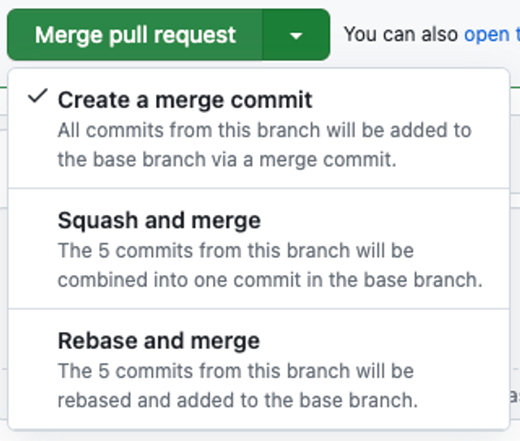
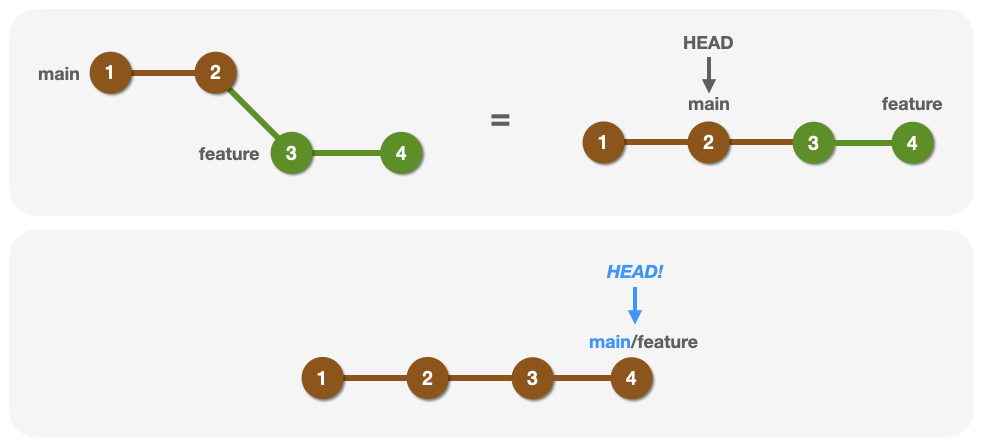
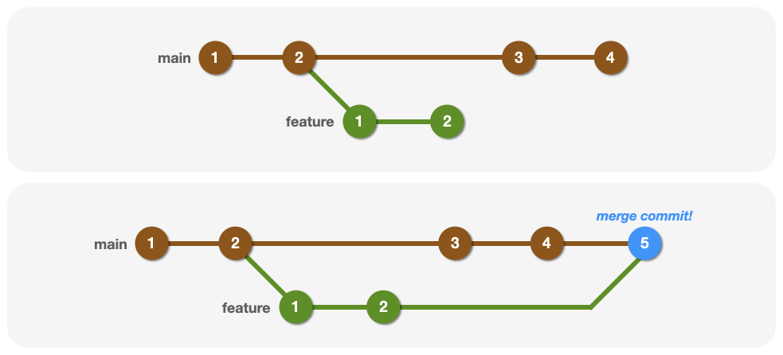
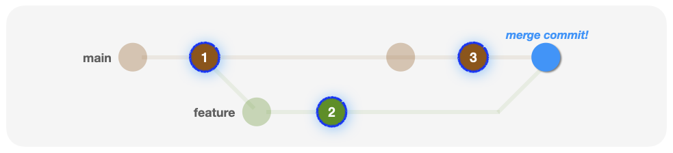
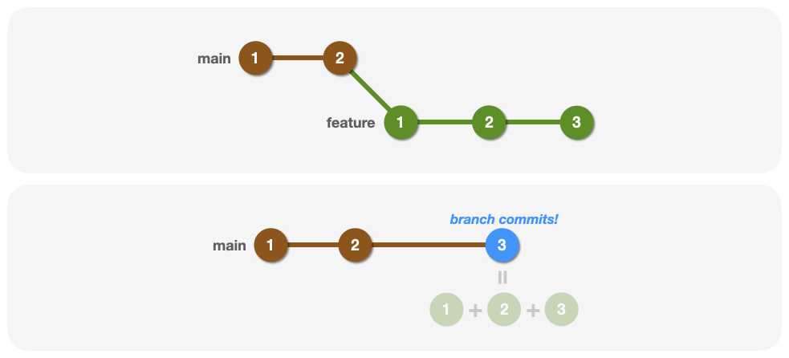
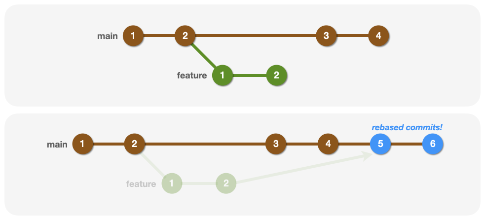

# Week.2 Weekly Paper

🙋‍♂️Author: Heedong0924

original source: [더 깔끔한 노션 페이지](https://mammoth-sodium-807.notion.site/Week2-Weekly-Paper-1d2aa082e03680d995d2ff14ae2d14cd?pvs=74)

# **❓Git에서 branch merge 방법들과 각 방법의 특징을 설명해 주세요.**

## 1. branch merge란?

*‘branch’*는 _‘나뭇가지’_ 라는 뜻으로 Git으로 관리되는 프로젝트의 개발 흐름을 tree(나무)라고 생각했을 때 분기되는 독립적인 개발 라인을 뜻한다.

*‘merge’*는 ‘합병[병합]하다’, ‘합치다’ 와 같은 사전적 의미를 가지고 있다.

이 둘을 합친 단어인 **branch merge**는 결국 서로 분리된 개발 흐름을 **하나로 합친다**는 의미이다.

## 2. 다양한 merge 방법들

branch를 병합하는 방법에는 여러 방법들이 존재한다.

Git을 관리하는 저장소인 GitHub에서도 다양한 merge 중 하나를 선택할 수 있도록 제시한다.



1. **Create a merge commit**
   가장 일반적인 형태로, 모든 commit의 기록을 남겨 새로운 merge commit을 생성하는 형태
1. **Squash and merge**
   commit을 한 덩어리로 합쳐서 merge하는 형태
1. **Rebase and merge**
   base를 변경하는 방식. 기존 개발 흐름 위로 분기된 개발 흐름을 다시 재배치하여 merge하는 형태

### (1) Merge Commit

Merge Commit은 두 개 이상의 브랜치를 병합할 때 생성되는 특별한 커밋으로, 3-way merge 방식에서 생성

이 때, 병합된 브랜치들의 변경 이력을 보존하고, 그 결과를 하나의 merge commit으로 기록하는 형태이다.

물론 항상 merge commit이 생성되는 것은 아니다.
FF(Fast-Forward)형식의 merge가 진행되면, merge commit이 남지 않는다.



참고로 CLI환경에서의 merge는 기본적으로 Fast-Forward(FF)를 우선시하지만, GitHub에서는 따로 설정하지 않는 이상 `—no-ff` 가 기본 동작이기 때문에 Create a merge commit 선택 시 항상 merge commit이 생성된다.

다시 본론으로 돌아와,

병합된 이력이 남아있는 merge commit은 두 개 이상의 부모 커밋을 가지는 커밋이다.

아래는 merge commit의 동작 원리와 3-way merge를 할 때 고려되는 커밋들을 표시한 사진이다.





```shell
$git merge {branch}
```

장점

1. 분기와 병합의 히스토리를 전부 보존시키기 때문에, 협업에 안전하며 충돌 해결 이력도 명확하게 남는다.여러 개발자가 동시에 작업을 해도 충돌 이력을 확인하고 세세하게 관리할 수 있다. (추적 용이)
1. 브랜치 별 변경사항이 유지되므로 commit들의 ID가 바뀌지 않는다.
1. Git이 병합 히스토리를 인지함으로 이후 `revert`, `cherry-pick` 등을 할 때 병합 지점을 이해할 수 있다.

단점

1. 병합이 될 때마다 커밋이 발생. 다양한 브랜치들을 병합 시 커밋 로그가 굉장히 복잡해진다.

### (2) Squash and merge

*‘\***\*squash\*\***’*의 사전적 의미는 _‘짓누르다’_, _‘찌부러뜨리다’_, _‘밀어 넣다[쑤셔 박다]’_ 등이 있다.

의미 그대로, 여러 커밋이 존재하는 경우 이를 하나로 합쳐 하나의 커밋으로 압축시키는 형태의 머지 전략을 Squash and merge라고 한다.

주로 기능 단위로 작업한 브랜치를 병합할 때, 세부 작업 커밋들을 하나의 커밋으로 압축하여 메인 브랜치를 간결하게 반영하는 데 사용된다.

새롭게 생성된 커밋은 새로운 SHA 하나를 생성하게 된다.



```shell
$git merge --squash {branch}
```

장점

1. 세부적인 커밋들을 하나로 통합하기 때문에 main 브랜치가 깔끔해진다.
1. 상세한 구현 사항들을 기술하지 않고 하나의 기능 단위로 커밋이 생성되기 때문에 하나의 커밋이 하나의 작업 단위를 명료하게 표현한다.
1. 따라서 기능별 PR 리뷰 시에도 가독성이 유리해지고 릴리즈 로그를 관리할 때도 버전별 변경 사항을 한 눈에 보기 쉽다.

단점

1. feature에서 작업한 상세 커밋 로그가 main에는 남지 않기 때문에 커밋 이력의 손실이 발생한다.
1. 원래의 커밋 SHA가 사라지고 새로운 SHA로 대체된다.
1. 따라서 협업 중, 충돌 발생으로 인한 커밋 이력 추적 시 불리하다.

### (3) Rebase and merge

*‘rebase’*란 _‘기초’_, _‘토대’_, _‘근거지’_ 등의 의미를 지닌 *‘’base’*라는 단어 앞에 *‘re-’*가 붙은 것으로, ‘기초를[기반을] 다시 잡다.’ 라는 의미를 가진다.

merge에서 말하는 rebase는 기준 브랜치의 최신 커밋 위에 작업 브랜치의 커밋들을 ‘재배치’ 하는 것을 의미한다.



장점

1. 커밋 로그가 선형적으로 깔끔하게 유지된다. 따라서 git log, git blame 등 사용 시 추적이 간편해진다.
1. squash와 다르게 각 커밋의 내용을 그대로 보존한다.
1. 각 커밋의 커밋 메세지 또한 그대로 보존한다.

단점

1. 각 커밋은 새로 생성되는 거라 SHA 자체는 대체된다.
1. 각 커밋마다 충돌이 발생할 수 있다. (자동 병합보다 훨씬 까다롭다.)
1. 다양한 브랜치가 존재하면 병합이 어렵다.

💭 [Reference]

[https://dev-district.tistory.com/21](https://dev-district.tistory.com/21)

# **❓Git Flow 브랜치 전략에 대해 설명해 주세요.**

## 1. Git Flow란?

**Git Flow**는 *Vincent Driessen*이 제안한 소프트웨어 개발을 위한 Git 브랜치 모델이다.

복잡한 프로젝트에서 개발, 배포, 패치 등 다양한 작업들을 체계적으로 분리하여 진행할 수 있도록 설계되었으며, 핵심 전략으로는 브랜치마다 역할을 명확하게 구분하는 것이다.


1. main : 메인 브랜치는 최종 제품 릴리즈가 있는 배포용 브랜치
1. develop : 다음 출시 버전을 개발하는 브랜치. 개발용 default 브랜치로 이 브랜치를 기준으로 feature를 따고 각 feature를 합치는 브랜치
1. feature/\* : 제품의 단위 기능을 개발하는 브랜치
1. release/\* : 이번 출시 버전을 준비하는 브랜치 (QA 등)
1. hotfix/\* : 출시 버전에서 발생한 버그를 수정하는 브랜치

## 2. Git Flow 전략의 개발 흐름

1. 신규 기능 개발을 위해 개발자는 `develop` 브랜치를 기준으로 `feature` 브랜치를 따서 작업을 진행
1. 작업이 완료된 `feature` 브랜치는 `develop` 브랜치로 병합됨
   (일반적으로 PR을 보내 작업 내용에 대한 Review를 받은 후 해당 PR이 Merge됨)
1. 다음 출시 버전을 위해 개발 중인 `develop` 브랜치에서 `release` 브랜치를 따서 배포를 위한 준비를 진행
   (발견되는 버그들은 `release` 브랜치에 즉각 반영)
1. 테스트 후, 버전 단위로 `main` 브랜치로 병합하여 제품 출시
1. 상용 배포 후, `release` 브랜치에서 미처 발견하지 못한 새로운 버그들을 `hotfix` 브랜치에서 바로 반영

💭 [Reference]

[https://devocean.sk.com/blog/techBoardDetail.do?ID=165571&boardType=techBlog](https://devocean.sk.com/blog/techBoardDetail.do?ID=165571&boardType=techBlog)
